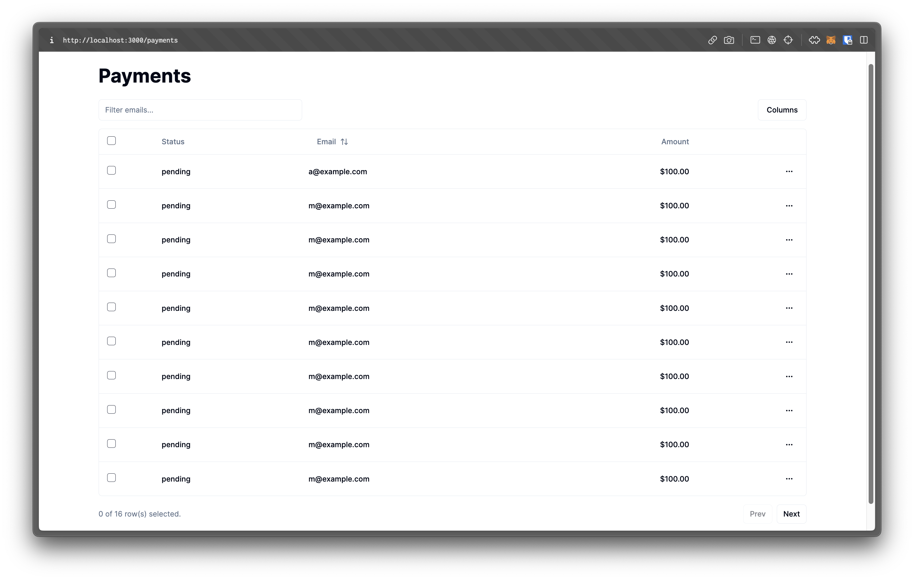

Este é um projeto [Next.js](https://nextjs.org/) inicializado com [`create-next-app`](https://github.com/vercel/next.js/tree/canary/packages/create-next-app).

No desenvolvimento, foram utilizadas as ferramentas Next.js, Tailwind CSS, Typescript, Shadcn/UI e TanStack com o objetivo de aprender mais sobre essas tecnologias.

Exemplo do que foi desenvolvido:



## Começando

Primeiro, execute o servidor de desenvolvimento:

```bash
npm run dev
# ou
yarn dev
# ou
pnpm dev
# ou
bun dev
```

Abra http://localhost:3000 no seu navegador para ver o resultado.

Você pode começar a editar a página modificando app/page.tsx. A página é atualizada automaticamente conforme você edita o arquivo.

Este projeto utiliza next/font para otimizar e carregar automaticamente a fonte Inter, uma fonte personalizada do Google.

## Aprenda Mais

Para aprender mais sobre as tecnologias utilizadas nesse projeto, confira os seguintes recursos:
- [Next.js](https://nextjs.org/)
- [Tailwind CSS](https://tailwindcss.com/)
- [Typescript](https://www.typescriptlang.org/)
- [Shadcn/UI](https://ui.shadcn.com/)
- [TanStack](https://tanstack.com/)